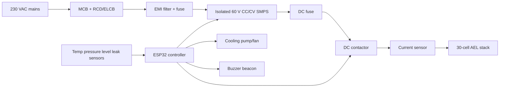

# Power Electronics Design

## Recommended Approach

Use a certified isolated 60 V class CC/CV power supply instead of an improvised mains transformer and rectifier. This reduces mains hazard and makes current limiting easier.

Professional electrician review is strongly recommended for all 230 VAC wiring, protective earth bonding, RCD/ELCB selection, fuse selection, and enclosure layout.

## Electrical Targets

| Parameter | Target |
|---|---:|
| AC input | 230 VAC single phase |
| DC output range | 45-66 V DC adjustable |
| Current range | 7-14 A continuous |
| Nominal output | 61.5 V, 10.2 A |
| Maximum design power | 833 W continuous |
| Supply rating | 60 V, 15-20 A, isolated CC/CV |

## Power Modes

| Daily energy | Average power | Approx current at 61.5 V |
|---:|---:|---:|
| 10 kWh/day | 417 W | 6.8 A |
| 15 kWh/day | 625 W | 10.2 A |
| 20 kWh/day | 833 W | 13.5 A |

## Block Diagram



## Alternate Transformer/Rectifier Path

Only use this path with professional review.

```text
230 VAC -> 48 VAC isolation transformer, >=1 kVA
48 VAC -> 100 A bridge rectifier with heatsink
Rectifier -> DC choke or limited capacitance
DC -> current-controlled buck stage
Buck -> electrolyzer stack
```

## Core Protection

| Protection | Recommendation |
|---|---|
| AC shock | RCD/ELCB, earth bonding, insulated enclosure |
| AC overcurrent | MCB and fuse matched to supply |
| DC short | DC-rated fuse near PSU output |
| DC disconnect | DC contactor controlled by ESP32 safety chain |
| Reverse/backfeed | Blocking diode or PSU-rated isolation where required |
| Overtemperature | Firmware shutdown plus independent thermal cutoff preferred |
| Arc prevention | No exposed DC bus, strain relief, covered terminals |

## Controller Interface

The ESP32 should not switch stack current directly. It should drive an opto-isolated MOSFET or relay driver controlling a DC contactor coil. For supplies with remote enable or analog current programming, keep the control wiring isolated from the high-current DC bus.

## Suggested Component Classes

| Component | Spec |
|---|---|
| SMPS | 60 V, 15-20 A, isolated, CC/CV preferred |
| DC contactor | >=80 V DC, >=30 A |
| DC fuse | 20-25 A DC-rated |
| Current sensor | ACS758 50/100 A Hall sensor or shunt with isolated amplifier |
| Voltage sense | High-value divider, fuse, TVS, ADC filtering |
| Control supply | Separate isolated 5 V supply for ESP32 |
