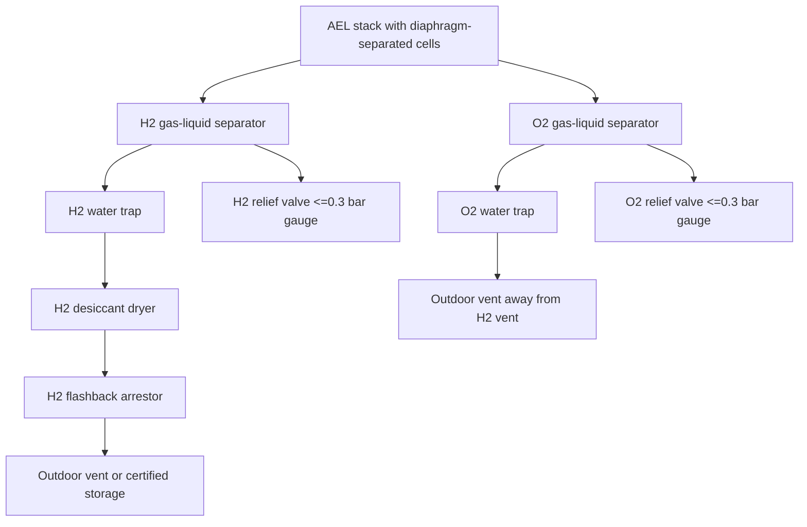

# Gas Safety Architecture

## Non-Negotiable Rule

Do not produce or collect mixed H2/O2 gas. Mixed oxyhydrogen gas is explosive over a broad range and is not acceptable at this scale.

The stack, separator, outlets, traps, and reservoirs must preserve separate hydrogen and oxygen streams.

## Gas Path Diagram



## Required Safety Components

| Component | Placement | Purpose |
|---|---|---|
| H2 gas-liquid separator | Immediately after H2 stack outlet | Knock out entrained KOH/water |
| O2 gas-liquid separator | Immediately after O2 stack outlet | Knock out entrained KOH/water |
| H2 water trap | Downstream of H2 separator | Secondary liquid protection |
| O2 water trap | Downstream of O2 separator | Secondary liquid protection |
| H2 desiccant dryer | After H2 trap | Dry H2 for downstream use |
| H2 flashback arrestor | After dryer, before user/storage line | Stop flame propagation |
| Check valves | H2 and O2 outlet lines | Reduce reverse flow risk |
| Relief valves | Both gas-liquid separators | Prevent overpressure |
| H2 detector | High point of enclosure/room | Leak alarm and shutdown |
| Ventilation fan | High exhaust preferred | Prevent H2 accumulation |

## Ventilation

Outdoor shed operation is preferred. For a garage or enclosed room:

- install forced exhaust near the ceiling,
- provide low-level make-up air,
- place the H2 sensor near likely accumulation points,
- keep ignition sources outside the gas handling compartment,
- vent H2 and O2 outdoors in separate directions.

Hydrogen is buoyant and diffuses quickly, but this is not a substitute for ventilation.

## Pressure Philosophy

The prototype should operate near atmospheric pressure. Do not seal outlets. Do not connect to pressure storage without professional review.

Recommended prototype limit:

```text
Normal: near atmospheric
Alarm: 0.15-0.20 bar gauge
Relief: <=0.3 bar gauge
Absolute prohibition: blocked outlet operation
```

## Purity Warning

Drying removes water vapor, not oxygen contamination. If hydrogen is used for fuel or storage, verify oxygen crossover with a suitable gas analyzer. Do not assume 99.5% purity from the separator alone.
