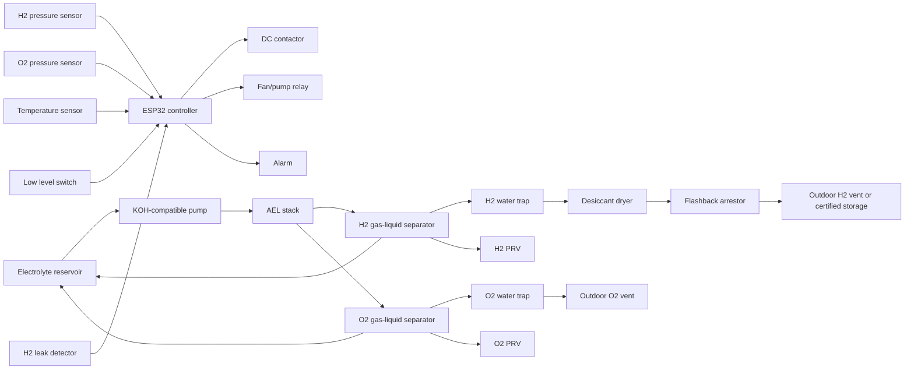

# Enclosure and Plumbing

## Materials

| Part | Recommended material | Notes |
|---|---|---|
| Electrolyte reservoir | HDPE or polypropylene | KOH-compatible |
| Cell frames | HDPE or polypropylene | Machineable and alkaline-resistant |
| Clear viewing parts | Avoid acrylic for hot KOH pressure service | Acrylic may craze/crack |
| Tubing | PTFE, polypropylene, or polyethylene | Check temperature and KOH compatibility |
| Gaskets | EPDM, PTFE, or FKM | Verify compatibility with hot KOH |
| Fasteners | Stainless steel outside electrolyte path | Avoid wetted galvanic couples |
| Electrical enclosure | Earthed metal or flame-retardant plastic | Keep separate from gas compartment |

## Pressure Rating

Use fittings and tubing rated well above expected pressure.

```text
Minimum component rating: >=2 bar
Operating prototype pressure: near atmospheric
Relief target: <=0.3 bar gauge
```

The high component rating is a safety margin, not permission to operate at high pressure.

## Plumbing Philosophy

- separate H2 and O2 from the stack onward,
- no shared bubbler,
- no shared gas reservoir,
- route lines upward where possible to avoid liquid pooling,
- place drains at low points,
- use secondary containment under electrolyte vessels,
- keep gas lines away from electrical terminals.

## P&ID



## Layout Guidance

Keep the electrical compartment, wet electrolyte compartment, and gas handling compartment physically separated. If they must share one enclosure, use internal partitions, drip shields, strain relief, and high-point ventilation.

Recommended placement:

| Item | Placement |
|---|---|
| Stack | Inside secondary containment |
| Gas-liquid separators | Above stack outlet level |
| Reservoir | Below separators for return flow |
| ESP32 | Dry electrical compartment |
| SMPS | Ventilated electrical compartment |
| H2 detector | High point of gas compartment |
| Emergency stop | External, obvious, accessible |
